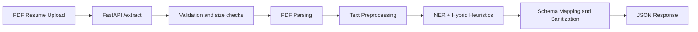

# Project Manual: Cloud Resume Extraction

This manual is intentionally standalone. It describes the project, the system design, the API, the model, the training flow, the deployment flow, the evaluation strategy, and the risks in one place without referring to other documents.

Use this manual for supervisor explanation, team onboarding, deployment planning, demo preparation, and implementation review.

---

## 1. Project Overview

**Project title:** Resume Information Extraction System

**Alternate wording:** Cloud-Based Resume Information Extraction System

**One-line summary:** A cloud-hosted NLP service that accepts PDF resumes, extracts and cleans text, runs a fine-tuned Transformer + LoRA named-entity extraction pipeline, and returns structured JSON for downstream hiring and screening workflows.

**Problem solved:** Resumes are often unstructured, visually inconsistent, and sometimes scanned. Recruiters and automated screening systems need machine-readable candidate data, but manual extraction is slow and error-prone.

**Main users / stakeholders:**

- recruiters and HR teams
- companies processing large resume volumes
- automated applicant tracking workflows
- examiners reviewing a live cloud + NLP system

**Main deliverable:** A REST API that takes a resume PDF and returns a JSON profile containing extracted fields such as name, email, phone, skills, education, and experience.

**Why the project matters:** It combines a realistic cloud deployment, a meaningful NLP component, and a production-style API workflow in a scope that can be demonstrated within a semester.

---

## 2. Scope and MVP

The repository is intentionally designed so the minimum viable product can be demonstrated end-to-end without requiring a database or a microservices architecture.

### MVP

- upload a PDF resume
- extract text from the document
- preprocess the text
- run NER and fallback heuristics
- return structured JSON over HTTP
- show baseline vs fine-tuned evaluation artifacts
- deploy the API in Docker on AWS EC2

### Optional / stretch

- add SQLite persistence for extracted responses
- retain uploaded PDFs in S3 or another bucket
- improve OCR quality for difficult scans
- extend extracted fields beyond the main schema
- add better latency tracking and monitoring
- add load balancing or an HTTPS reverse proxy in front of EC2

### Out of core scope

- a full applicant tracking system
- user authentication and account management
- document storage as a primary business feature
- microservices decomposition

The project is a **modular monolith**: one FastAPI application, one pipeline, one model directory, and one JSON contract.

---

## 3. End-to-End System Flow



### Runtime sequence

1. Client uploads a PDF to `POST /extract`.
2. The API validates MIME type, file size, and read timeout.
3. The parser extracts text using PyMuPDF first, then pdfminer.six if embedded text is weak, and OCR if required.
4. The preprocessor cleans noise and normalizes resume text.
5. The NER engine loads the LoRA-adapted model or the merged inference bundle and optionally merges heuristic fallback rules.
6. The formatter sanitizes the final candidate profile.
7. The API returns `profile`, `metadata`, and optional `debug` content.

---

## 4. Architecture by Layer

### 4.1 API layer

Responsibilities:

- create the FastAPI application
- expose `/health`
- expose `/extract`
- enforce request validation and response schema
- return traceable metadata for debugging and evaluation

### 4.2 PDF parsing layer

The parser follows a quality-first extraction strategy:

1. **PyMuPDF** for fast embedded text extraction
2. **pdfminer.six** fallback when embedded text is weak
3. **Tesseract OCR** for scanned or image-only PDFs

Why this matters:

- resumes often contain scanned pages or irregular layouts
- extraction quality directly affects downstream NER quality
- parser metadata is surfaced in API responses for transparency

### 4.3 Preprocessing layer

Responsibilities:

- normalize whitespace
- remove OCR artifacts and unstable character noise
- stabilize input before inference
- preserve deterministic behavior for repeated inputs

The preprocessor is intentionally conservative: it should improve NER input without destroying valid resume content.

### 4.4 NLP / inference layer

Core model:

- `bert-base-cased`
- token classification head
- LoRA / PEFT adaptation
- BIO-style NER labels for resume fields

Supported labels / entity groups include:

- NAME
- SKILL
- EDUCATION
- EXPERIENCE
- COMPANY
- DATE
- LOCATION

The runtime path is a **hybrid NER pipeline**:

- if the model is confident enough, output comes from the NER path
- if model loading or inference fails, heuristics can fill gaps
- if mock mode is enabled, the service falls back to deterministic rules

This keeps the demo robust even when OCR or model confidence is uneven.

### 4.5 Schema and formatting layer

Responsibilities:

- define the response contract
- sanitize strings and lists
- ensure the output is stable JSON, not free-form text

### 4.6 Evaluation layer

Evaluation is offline, not in the request path.

The repository also produces benchmark and metric artifacts for model quality and parser quality.

---

## 5. Repository Map

| Area | Purpose |
|------|---------|
| FastAPI app | application bootstrap and liveness check |
| Resume extraction route | upload handling and JSON extraction endpoint |
| Parser | PDF parsing and OCR |
| Preprocessor | text normalization and cleanup |
| Heuristics | rule-based fallback extraction |
| NER engine | LoRA NER loading and hybrid inference |
| Formatter | output sanitization |
| Response schema | structured JSON response models |
| Training scripts | LoRA training and model export |
| Evaluation scripts | baseline vs fine-tuned comparison |
| Tests | automated validation |
| Postman collection | API testing |
| Model directory | checkpoints, adapter, and merged bundle |
| Manifests | dataset inventory and label maps |
| Reports | generated metrics and benchmarks |
| Dockerfile | container image definition |
| Requirements files | full dev/training dependencies and slim runtime dependencies |

### Important repository conventions

- local dataset files are ignored because they may contain training PDFs and exports
- the runtime model directory contains the adapter and merged bundle
- the merged bundle is preferred at inference time when available

---

## 6. Project Title and Proposal Wording

### Recommended title

**Resume Information Extraction System**

### Optional expanded title

**Cloud-Based Resume Information Extraction System**

### Concept-note phrasing

The project is a cloud-hosted service that performs automated structured data extraction from unstructured PDF resumes using a fine-tuned NLP model and AWS cloud deployment.

This wording is still valid because the implementation follows that pipeline.

---

## 7. Problem Statement, Target Users, and Value

### Problem statement

Resumes are highly variable in layout, formatting, and scan quality. Manual extraction of candidate information is time-consuming, inconsistent, and hard to scale. Rule-based parsers and simple keyword matching often fail when resume styles differ.

### Target users

- recruiters
- HR departments
- ATS / resume screening workflows
- companies that need scalable resume intake
- examiners reviewing a live cloud + NLP system

### Why it is worth solving

- it has direct practical value
- it demonstrates cloud deployment plus NLP in one system
- it can be tested end to end in a semester
- it allows measurable evaluation with F1 / parser metrics / latency

---

## 8. Technology Stack

### Core language and framework

- Python
- FastAPI

### NLP / ML

- Hugging Face Transformers
- PyTorch
- LoRA / PEFT
- token classification for NER

### PDF and OCR

- PyMuPDF
- pdfminer.six
- Tesseract OCR
- Pillow

### Cloud / deployment

- Docker
- AWS EC2
- AWS S3
- AWS IAM
- CloudWatch

### API testing / interchange

- Postman
- OpenAPI / Swagger UI
- JSON

### Testing and utilities

- pytest
- requests-mock
- standard library logging

### Storage stance

- default runtime: stateless API
- optional: SQLite if persistence is required by the rubric
- optional: S3 for archiving model artifacts or uploaded resumes

---

## 9. API Contract

### Base URL

- local: `http://127.0.0.1:8000`
- EC2: `http://<public-ip>:8000`

### Endpoints

| Method | Path | Description |
|--------|------|-------------|
| GET | `/health` | liveness check |
| GET | `/docs` | Swagger UI |
| GET | `/openapi.json` | OpenAPI schema |
| POST | `/extract` | upload a PDF resume and receive structured JSON |

### Request format

`POST /extract` accepts multipart form data with:

- field name: `file`
- file type: PDF
- optional query parameter: `debug=true`

### Response format

The response contains:

- `profile`
- `metadata`
- `debug` when requested

#### Core profile fields

- `name`
- `email`
- `phone`
- `skills[]`
- `education[]`
- `experience[]`

#### Metadata fields

- `request_id`
- `parser_used`
- `parser_quality`
- `parser_confidence`
- `text_length`
- `confidence`
- `processing_ms`
- `inference_backend`

### Inference backend values

| Value | Meaning |
|-------|---------|
| `ner_lora_hybrid` | NER ran successfully and heuristics were merged where useful |
| `mock_heuristic` | heuristic-only fallback or mock mode |
| `mock_heuristic_fallback` | NER failed and the fallback path was used |

### Error handling

Typical structured errors include:

- `invalid_content_type`
- `empty_file`
- `upload_timeout`
- `file_too_large`
- `parse_failed`

### Debug mode

With `debug=true`, the API returns:

- `raw_text`
- `cleaned_text`
- `detected_sections`
- `final_profile`

This is useful for demoing the pipeline and diagnosing OCR or parser issues.

---

## 10. NLP / Model Details

### Base model

- `bert-base-cased`

### Adaptation

- LoRA via PEFT
- token classification head for resume fields
- merged deployment bundle for inference

### Why LoRA was chosen

- lower memory and compute cost than full fine-tuning
- practical for the course timeline and available hardware
- easier to iterate on label quality and training settings

### Label space

BIO tags cover key resume entity groups:

- NAME
- SKILL
- EDUCATION
- EXPERIENCE
- COMPANY
- DATE
- LOCATION
- O

### Inference behavior

The service uses document-relative confidence gating rather than a single absolute threshold. This is important because token scores in multi-class softmax are often small in absolute value even when the predictions are meaningful.

### Runtime model selection

The API loads from the configured model directory and prefers a merged bundle when a full model configuration is present. Otherwise it loads the adapter and merges LoRA weights at runtime.

### Practical limitations

- BERT length limit: 512 tokens
- scanned PDFs require OCR quality
- poor label alignment degrades entity F1

---

## 11. PDF Parsing and Preprocessing

### Parsing strategy

1. **PyMuPDF** for direct embedded text
2. **pdfminer.six** when the embedded text is weak
3. **Tesseract OCR** for scanned/image-only pages

### Metadata surfaced by the parser

- parser used
- parser quality
- parser confidence
- text length

### Preprocessing objectives

- stabilize input before NER
- remove common OCR artifacts
- normalize whitespace and line structure
- support deterministic fallback heuristics

### Heuristic section detection

When NER is disabled or fails, the system can still produce useful output by detecting resume sections such as:

- experience
- education
- skills
- contact information

This keeps the demo resilient even on lower-quality documents.

---

## 12. Training Pipeline

### Dataset shape

- token-classification JSON examples
- train/validation split
- label map for entity IDs

### Training steps

1. validate dataset rows with the dataset audit script
2. train the LoRA model
3. export the merged bundle if needed
4. compare baseline vs fine-tuned metrics

### Key training goals

- improve resume-field extraction over baseline
- maintain stable entity schema
- keep inference compatible with FastAPI deployment

### Relevant environment overrides

| Variable | Purpose |
|----------|---------|
| `RESUME_EPOCHS` | training epochs |
| `RESUME_EARLY_STOPPING_PATIENCE` | early stopping |
| `RESUME_BATCH_SIZE` | per-device batch size |
| `RESUME_LR` | learning rate |
| `RESUME_LORA_R` | LoRA rank |
| `RESUME_LORA_ALPHA` | LoRA scaling |
| `RESUME_LORA_TARGET_MODULES` | targeted transformer modules |
| `RESUME_WARMUP_RATIO` | warmup fraction |
| `RESUME_SAVE_TOTAL_LIMIT` | checkpoint cap |

---

## 13. Evaluation and Metrics

### Offline evaluation artifacts

- baseline metrics JSON
- fine-tuned metrics JSON
- parser benchmark JSON

### Model metrics

- precision
- recall
- F1-score
- overall entity F1
- macro F1 when present

### Functional metrics

- JSON schema validity
- parser success rate
- API latency
- output completeness

### Comparison model

- baseline: untrained classification head on the same BERT backbone
- fine-tuned: merged LoRA checkpoint

### Why baseline comparison matters

It shows that the gains come from the fine-tuning and not just from the backbone model alone.

---

## 14. Cloud and Deployment Plan

### Docker runtime

The project is designed to run in Docker using a slim runtime dependency set.

### AWS EC2 deployment pattern

1. launch an Ubuntu EC2 instance
2. install Docker
3. clone the repository to the instance
4. attach an IAM role for S3 access
5. upload model artifacts to S3
6. run the container with the S3 model URI
7. expose port `8000`
8. test via `curl`, browser, or Postman

### S3 usage

S3 is used for model artifact storage in the deployment workflow. The container can download the final model bundle at startup.

### IAM usage

The EC2 instance receives a role with:

- `s3:ListBucket`
- `s3:GetObject`

scoped to the model bucket and prefix.

### CloudWatch / logging

CloudWatch is the intended logging and monitoring path for the deployment. The runtime can be observed through container logs and AWS operational tooling.

### Security posture

- use security groups to restrict SSH and API ports
- avoid committing environment files or private keys
- prefer IAM roles instead of long-lived AWS keys on disk

---

## 15. Local Development and Quick Start

### Install dependencies

Use the appropriate Python environment in your machine, then install the required packages.

### Run tests

```bash
export PYTHONPATH="$PYTHONPATH:$(pwd)/code"
python -m pytest code/tests/
```

### Run the API locally

```bash
export PYTHONPATH="$PYTHONPATH:$(pwd)/code"
uvicorn app.main:app --reload --host 0.0.0.0 --port 8000
```

### Open docs

- Swagger UI: `http://127.0.0.1:8000/docs`
- Health check: `http://127.0.0.1:8000/health`

### Docker build

```bash
docker build -t resume-extraction .
```

### Docker run with local model

```bash
docker run -d --name resume-api -p 8000:8000 \
  -e USE_MOCK_INFERENCE=0 \
  -e RESUME_MODEL_PATH=<model-directory> \
  resume-extraction
```

### Docker run with S3 model

```bash
docker run -d --name resume-api -p 8000:8000 \
  -e USE_MOCK_INFERENCE=0 \
  -e RESUME_MODEL_PATH=<model-directory> \
  -e MODEL_S3_URI=s3://<bucket>/<model-prefix> \
  resume-extraction
```

---

## 16. Postman and Remote Testing

### Postman workflow

1. import the collection
2. set the base URL
3. send a PDF to `POST /extract`
4. verify JSON structure and metadata
5. repeat against local Docker and the EC2 URL

### Why Postman matters

It provides a demo-friendly way to show a full request/response cycle without writing custom client code.

---

## 17. Demo Scenario

### Suggested examiner flow

1. show `/docs`
2. show `/health`
3. upload a new PDF through `POST /extract`
4. point to parser metadata and processing time
5. show the profile JSON output
6. repeat with `debug=true` if needed
7. compare baseline vs fine-tuned metrics
8. show the public EC2 URL if deployed remotely

### What the examiner should see

- working API
- readable JSON output
- meaningful metadata
- cloud deployment evidence
- evaluation artifacts demonstrating improvement

---

## 18. Storage Decision

### Default stance

The core demo is **stateless**. It does not require SQLite.

### Optional add-on

If persistence is required, add SQLite as a thin optional layer to log extraction requests and outputs.

### Why this choice was made

- keeps the API simple
- avoids unnecessary operational overhead
- keeps local development and CI straightforward

---

## 19. Risks, Ethics, and Constraints

### Main risks

- PDF parsing failure or noisy OCR
- model truncation on long resumes
- privacy leakage via logs
- cloud cost or open security groups
- weak baseline metrics confusing reviewers

### Mitigations

- parser fallback chain plus benchmark data
- hybrid heuristics when NER confidence is low
- minimal logging of PII
- security group scoping and Docker runtime limits
- offline evaluation report showing fine-tuned improvement

### Ethical / privacy note

Only process data you are allowed to use. Prefer public or synthetic data for demos, and avoid logging full resume text in production.

---

## 20. Troubleshooting

### Common issues and fixes

| Symptom | Likely cause | Fix |
|---------|--------------|-----|
| `422 parse_failed` | scanned PDF or missing OCR binary | install Tesseract and verify parser settings |
| `mock_heuristic` only | model not found or mock mode enabled | disable mock mode and verify the model directory |
| `file_too_large` | PDF over 10 MB | reduce file size or use a smaller sample |
| `curl` to EC2 times out | security group or subnet ingress issue | open port `8000` and verify the instance is publicly reachable |
| empty education / experience | weak header detection | use `debug=true` and inspect cleaned text |
| poor F1 | data / label mismatch | audit the dataset and retrain |

### Debug utilities

- use `debug=true` on `/extract`
- inspect generated reports
- inspect the model card / training configuration
- rerun the parser benchmark after environment changes

---

## 21. Deliverables and Evidence

The repository contains the code and documentation required to demonstrate the project as a complete course deliverable:

- working FastAPI service
- PDF parsing and preprocessing pipeline
- LoRA NER model
- baseline and fine-tuned metrics
- parser benchmark
- Docker deployment
- EC2 deployment evidence
- Postman collection
- detailed architecture and implementation notes

---

## 22. Bottom Line

This project is a cloud-deployed resume extraction API built in Python/FastAPI, backed by a Transformer + LoRA NER model, with PDF parsing and OCR, JSON output, Docker packaging, and AWS EC2/S3/IAM deployment. The runtime path is modular, the evaluation path is documented, and the repository includes both code and evidence for the course deliverable.
