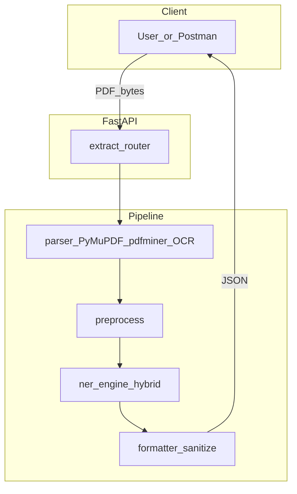

# Project manual — Cloud Resume Extraction

Complete reference for the repository: architecture, API, training, deployment, and alignment with course documents.

## Table of contents

1. [Executive summary](#1-executive-summary)
2. [Architecture](#2-architecture)
3. [Repository map](#3-repository-map)
4. [API](#4-api)
5. [Configuration and environment](#5-configuration-and-environment)
6. [Training and evaluation](#6-training-and-evaluation)
7. [Deployment and Postman](#7-deployment-and-postman)
8. [Troubleshooting](#8-troubleshooting)
9. [Document index (appendix)](#9-document-index-appendix)

---

## 1. Executive summary

**Problem:** Resumes are unstructured PDFs; recruiters and systems need **machine-readable** candidate fields.

**Solution (Concept note):** A **cloud-oriented** pipeline: upload PDF → extract text → preprocess → **fine-tuned Transformer + LoRA (NER)** → **JSON** with name, contact, skills, education, experience.

**This repo:** A **FastAPI** service (`POST /extract`) implements that pipeline. Heuristic rules **merge** with NER (`ner_lora_hybrid`) so output stays usable when the model or OCR is weak. Evaluation metrics are computed **offline** (scripts + `reports/`), not on every request.

**Proposal alignment:** Wording differences (e.g. pdfplumber vs pdfminer, “instruction-based” vs NER) are documented in [PROPOSAL_TECHNICAL_ALIGNMENT.md](PROPOSAL_TECHNICAL_ALIGNMENT.md).

---

## 2. Architecture

- **Parser:** [code/app/services/parser.py](../code/app/services/parser.py)
- **Preprocess:** [code/app/services/preprocess.py](../code/app/services/preprocess.py)
- **NER + merge:** [code/app/services/ner_engine.py](../code/app/services/ner_engine.py)
- **Heuristics:** [code/app/services/inference.py](../code/app/services/inference.py)
- **Schema:** [code/app/schemas/output_schema.py](../code/app/schemas/output_schema.py)

Detailed tables: [architecture.md](architecture.md), sketch: [Architecture_Sketch_Resume_Extraction.txt](Architecture_Sketch_Resume_Extraction.txt).

---

## 3. Repository map

| Path | Contents |
|------|----------|
| `code/app/main.py` | FastAPI app, `/health` |
| `code/app/routers/extract.py` | `POST /extract` |
| `code/app/services/` | parser, preprocess, ner_engine, inference, formatter |
| `code/scripts/` | `train.py`, `evaluate_baseline_vs_lora.py`, `audit_ner_dataset.py`, `parser_benchmark.py`, `export_merged_lora.py`, … |
| `code/tests/` | pytest suite |
| `code/postman/` | Postman collection JSON |
| `models/resume-ner/` | Training checkpoints, `final/` adapter + `merged/` bundle |
| `manifests/` | `dataset_inventory.csv`, splits, `label_map.yaml` (WP1) |
| `reports/` | `baseline_metrics.json`, `fine_tuned_metrics.json`, `parser_benchmark.json` (generated) |
| `DOCS/` | All markdown + course TXT sources |
| `Dockerfile` | API image (includes Tesseract) |
| `requirements.txt` / `requirements-min.txt` | Full vs Docker-min deps |

`dataset/` is **gitignored** (local training PDFs + JSON).

---

## 4. API

| Method | Path | Description |
|--------|------|---------------|
| GET | `/health` | Liveness |
| GET | `/docs`, `/openapi.json` | Swagger / OpenAPI |
| POST | `/extract` | Multipart `file` (PDF); optional `debug=true` |

**Response:** `profile` + `metadata` (`request_id`, `parser_used`, `parser_quality`, `parser_confidence`, `inference_backend`, `processing_ms`, …).

Full contract and errors: [api_guide.md](api_guide.md).

---

## 5. Configuration and environment

**Core**

- `USE_MOCK_INFERENCE` — `1` = no torch NER (tests / CI).
- `RESUME_MODEL_PATH` — model directory (default `models/resume-ner/final` from repo root when cwd is `code/`).

**OCR (scanned PDFs)**

- `TESSERACT_CMD` — path to binary on Windows if needed.
- `OCR_RENDER_ZOOM`, `OCR_TESS_PSMS`, `OCR_TESS_OEM` — see [preprocessing_rules.md](preprocessing_rules.md).

**NER gating (hybrid)**

- `NER_DOC_PEAK_MIN`, `NER_ABS_SCORE_FLOOR`, `NER_REL_TO_PEAK` — see [models/resume-ner/MODEL_CARD.md](../models/resume-ner/MODEL_CARD.md).

Copy [.env.example](../.env.example) to `.env` for local notes (FastAPI does not load `.env` unless you add `python-dotenv`; env vars are usually set in the shell or Docker).

---

## 6. Training and evaluation

1. **Sanity-check labels:** `python code/scripts/audit_ner_dataset.py`
2. **Train:** from `code/scripts`, `python train.py` (see [training_pipeline.md](training_pipeline.md) for env overrides).
3. **Evaluate baseline vs LoRA:** `python code/scripts/evaluate_baseline_vs_lora.py` → `reports/`.
4. **Export merged bundle (if needed):** `python code/scripts/export_merged_lora.py`

Narrative report: [final_evaluation_report.md](final_evaluation_report.md). Model card: [models/resume-ner/MODEL_CARD.md](../models/resume-ner/MODEL_CARD.md).

---

## 7. Deployment and Postman

- **Docker build/run:** [deployment.md](deployment.md)
- **EC2 security group, Postman `baseUrl`, Colab note:** [POSTMAN_AND_REMOTE_TESTING.md](POSTMAN_AND_REMOTE_TESTING.md)
- **Demo script:** [demo_script.md](demo_script.md)

---

## 8. Troubleshooting

| Symptom | Likely cause | What to do |
|---------|----------------|------------|
| `422` `parse_failed` / Tesseract message | Scanned PDF, no OCR binary | Install Tesseract (Dockerfile has it); Windows: see [code/README.md](../code/README.md); set `TESSERACT_CMD` if needed. |
| `Error: ... bind ... 8000` | Port in use | Stop other uvicorn / pick another port: `--port 8001`. |
| `inference_backend` always `mock_heuristic` | Mock forced or no model | `USE_MOCK_INFERENCE=0` and valid `models/resume-ner/final` (+ `merged/` optional). |
| Empty `experience` | Section headers not recognized | Heuristic headers expanded over time; try `debug=true` to inspect `cleaned_text` and `detected_sections`. |
| Weak NER spans | Model / data | Retrain; see training_pipeline + MODEL_CARD; hybrid fills gaps. |
| Phone wrong for `+20…` | Old code path | Current code handles Egypt `+20`; restart server after pull. |

Parser benchmark: [extraction_quality_report.md](extraction_quality_report.md).

---

## 9. Document index (appendix)

| Document | Purpose |
|----------|---------|
| [Architecture_Sketch_Resume_Extraction.txt](Architecture_Sketch_Resume_Extraction.txt) | Course architecture sketch |
| [Concept_Note_Resume_Extraction.txt](Concept_Note_Resume_Extraction.txt) | Course concept note |
| [Project_Idea_Proposal_Template_and_Supervisor_Checklist_Final.txt](Project_Idea_Proposal_Template_and_Supervisor_Checklist_Final.txt) | Proposal + checklist |
| [PROPOSAL_TECHNICAL_ALIGNMENT.md](PROPOSAL_TECHNICAL_ALIGNMENT.md) | Proposal vs implementation |
| [architecture.md](architecture.md) | Implementation architecture |
| [api_guide.md](api_guide.md) | HTTP API |
| [POSTMAN_AND_REMOTE_TESTING.md](POSTMAN_AND_REMOTE_TESTING.md) | Postman, cURL, Colab, GCP blurb |
| [deployment.md](deployment.md) | Docker + EC2 |
| [training_pipeline.md](training_pipeline.md) | Data + train + eval commands |
| [preprocessing_rules.md](preprocessing_rules.md) | Cleaning + OCR env |
| [extraction_quality_report.md](extraction_quality_report.md) | Parser WP2 |
| [final_evaluation_report.md](final_evaluation_report.md) | Metrics narrative |
| [demo_script.md](demo_script.md) | Examiner demo |
| [risks.md](risks.md) | Risks |
| [mvp_storage_decision.md](mvp_storage_decision.md) | SQLite / S3 scope |
| [supervisor_checklist_evidence.md](supervisor_checklist_evidence.md) | Evidence index |
| [Resume_Extraction_Full_Execution_Plan.md](Resume_Extraction_Full_Execution_Plan.md) | Full WBS (course) |

Index of all markdown in this folder: [README.md](README.md) (DOCS index).
