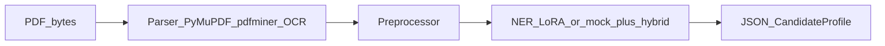

# Architecture (implementation view)

This document matches the pipeline in [Architecture_Sketch_Resume_Extraction.txt](Architecture_Sketch_Resume_Extraction.txt), [Concept_Note_Resume_Extraction.txt](Concept_Note_Resume_Extraction.txt), and [Resume_Extraction_Full_Execution_Plan.md](Resume_Extraction_Full_Execution_Plan.md). For proposal wording vs code, see [PROPOSAL_TECHNICAL_ALIGNMENT.md](PROPOSAL_TECHNICAL_ALIGNMENT.md).

## End-to-end flow

## Components

| Layer | Implementation |
|-------|------------------|
| API | FastAPI in `code/app/main.py`, router `code/app/routers/extract.py` |
| PDF parsing | `code/app/services/parser.py` — PyMuPDF → pdfminer.six (if weak embedded text) → Tesseract OCR |
| Preprocessing | `code/app/services/preprocess.py` |
| NLP | `code/app/services/ner_engine.py` — BERT + LoRA (`models/resume-ner/final/`, prefers `merged/` bundle), **`ner_lora_hybrid`** when `USE_MOCK_INFERENCE=0` |
| Heuristics | `code/app/services/inference.py` — section split, skill bank, contact regexes; used in mock path and **hybrid merge** |
| Schema / sanitize | `code/app/schemas/output_schema.py`, `code/app/services/formatter.py` |

## Inference backends (`metadata.inference_backend`)

| Value | When |
|-------|------|
| `ner_lora_hybrid` | Model directory ready, `USE_MOCK_INFERENCE` off, NER path succeeds |
| `mock_heuristic` | `USE_MOCK_INFERENCE=1` or no model |
| `mock_heuristic_fallback` | NER threw; heuristics used |

## Evaluation (offline)

Precision / Recall / F1 are **not** recomputed on every API request. They are produced by:

- `code/scripts/train.py` (per-epoch validation),
- `code/scripts/evaluate_baseline_vs_lora.py` → `reports/*.json`,
- documented in `DOCS/final_evaluation_report.md`.

This matches the architecture sketch clarification: **runtime** = FastAPI + pipeline; **evaluation** = scripts + reports.

## Request flow

1. Client `POST /extract` with multipart field `file` (PDF).
2. Validate type, size; read body with timeout.
3. Parse PDF to text; record `parser_used`, `parser_quality`, `parser_confidence`.
4. Clean text; run NER + hybrid merge (or mock); map to `CandidateProfile`.
5. Return JSON with `profile` and `metadata`.

## Configuration (high level)

| Variable | Purpose |
|----------|---------|
| `RESUME_MODEL_PATH` | Directory with adapter or `merged/` + `label_map.json` |
| `USE_MOCK_INFERENCE` | `1` forces heuristic-only path |
| `TESSERACT_CMD` | Optional path to `tesseract` binary (Windows) |
| `OCR_RENDER_ZOOM`, `OCR_TESS_PSMS` | Parser OCR tuning — see `preprocessing_rules.md` / `parser.py` |
| `NER_DOC_PEAK_MIN`, `NER_ABS_SCORE_FLOOR`, `NER_REL_TO_PEAK` | NER confidence gating — see `models/resume-ner/MODEL_CARD.md` |

See also `api_guide.md`, `deployment.md`, and `PROJECT_MANUAL.md`.
